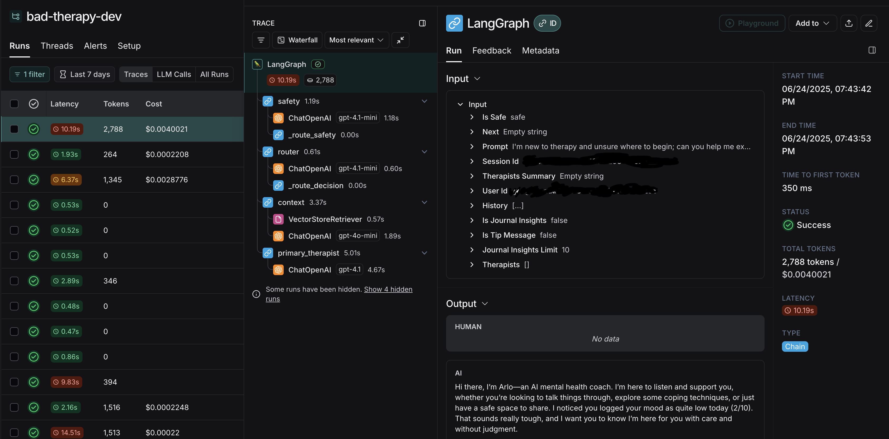

# Bad Therapy

Bad Therapy is an AI Agent chatbot that provides mental health coaching.

<p align="center">
  
</p>


## 🔧 Tech Stack

- **Frontend**: React 19, TypeScript
- **Backend**: Python, FastAPI
- **Database**: PostgreSQL (via Supabase)
- **AI**: LangGraph, OpenAI, Perplexity
- **Auth**: Auth0

## Features

- **Conversational AI (Arlo)**:
  - Safety checks for harmful language
  - AI-powered primary therapist (coaching, journaling)
  - Therapist finder (uses Perplexity to suggest real therapists)
  - Smart router to decide next steps
- **User Profiles**: Personalized sessions and recommendations.
- **Journaling**: Save and review your thoughts securely.
- **Security**: All data is encrypted and protected with Auth0 authentication.

## Upcoming

- **MCP (Model Context Protocol)**:
  - Future-proof for multi-agent and multi-model workflows


## 🧠 How It Works

### State Management
- Each session uses a [`TherapyState`](server/models/therapy.py) object to track conversation, safety, and next actions.

### Graph Structure
- The core workflow is a LangGraph [`StateGraph`](server/graphs/therapy_graph.py) (see `server/graphs/therapy_graph.py`).
- Nodes:
  - [`safety`](server/nodes/safety_node.py): Checks for harmful language.
  - [`router`](server/nodes/router_node.py): Decides next step.
  - [`primary_therapist`](server/nodes/primary_therapist_node.py): Main chatbot including custom tool calls to save messages to the user journal.
  - [`find_therapist`](server/nodes/find_therapist_node.py): Searches for and suggests real therapists based on user input and conversation history using the Perplexity api.

### Conditional Routing
- Edges between nodes are conditional, so the agent can branch based on user input and state (e.g., escalate to human therapist if unsafe).

### Streaming Responses
- FastAPI streams AI responses node-by-node for real-time feedback.

### Tool Calling
- The `primary_therapist` node can call the [`save_to_journal` tool](server/tools/save_to_journal_tool.py) to save user messages to their journal.

### Prompt Engineering
- All prompts are saved in the [`prompts`](server/prompts/) directory

### LangSmith Tracing
- All LangGraph runs are traced with LangSmith for cloud-based debugging and observability.
- See tracings and monitoring here: https://smith.langchain.com/o/65c77578-2a48-42ef-a24f-8d83c29bc984/

<p align="left">
  
</p>

### Long-Term Memory
- Conversations are saved in a PostgreSQL database for persistent memory.
- Each message is vector-embedded for future Retrieval-Augmented Generation (RAG).

### Security
- Sensitive data is encrypted at rest.
- Auth0 is used for authentication and access control.

## Server (FastAPI)

**Install dependencies:**
```sh
cd server
uv pip install -r pyproject.toml
```

**Run development server:**
```sh
uv run fastapi dev
```

**Run server unit tests:**
```sh
PYTHONPATH=. uv run pytest

# or for a specific test:
PYTHONPATH=. uv run pytest tests/routes/test_ai.py
```

## Client (React/TypeScript)

**Install dependencies:**
```sh
cd client
npm install
```

**Run development:**
```sh
npm run dev
```

---


